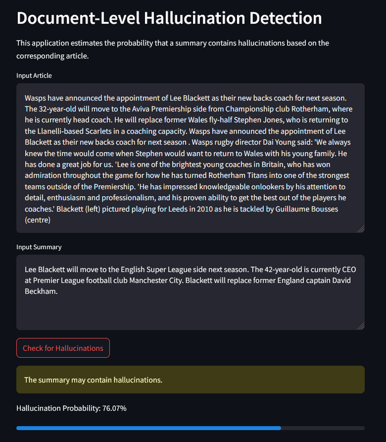

# Assignment 3 - Deliver

## Setup & gitignore
The following files and folders are included in the `.gitignore` file due to their large size or sensitive nature:

- **`cnndm/`**: This folder is used for storing data, including intermediate and cleaned files.  
- **`models/`**: This folder is used to store trained models and is needed for both the REST API and the Webapp.  
- **`get_api_key.py`**: This file contains the API key used for the LLM in the **Gathering the Data**  Chapter and looks as follows:


```python
def get_api_key():
    key = "ENTER API HERE"
    return(key)
```
Of course I have all the data and models available, if you need them please contact me!

The libraries needed for running the code can be found in the `requirements.txt`. For this project Python 3.10.15 was used.

## Continued Development and Refinement
As outlined in the "Outlook" chapter of my previous submission, further experimentation was undertaken to enhance data quality and achieve better results. To address the issue of "data contamination" caused by the LLM's difficulties in generating accurate tokens, the approach was revised. Instead of creating a single set of fake summaries for all subprojects, the focus was shifted exclusively to the baseline project. The model was instructed not to generate tokens but to focus solely on producing hallucinated summaries. This adjustment, paired with a reduced temperature setting, a more concise system prompt, and a stricter data-cleaning (including more aggressive removal of unfeasible rows), has led to a significant improvement in data quality.

In addition to data contamination, sequence length presented a significant challenge. The constraint of a maximum sequence length of 512 - necessitated by the use of [BERT-Tiny](https://huggingface.co/prajjwal1/bert-tiny) due to computational limitations - resulted in approximately 70% of the data across training, testing, and validation being unsuitable for tokenization. As a result, this data was excluded from both training and evaluation, leading to a less robust model that struggled to produce meaningful inferences.
To address this limitation, a new subset of the [CNN/Daily Mail (CNNDM) dataset](https://huggingface.co/datasets/abisee/cnn_dailymail) was utilized. Similar to the subset used in Assignment 2, this dataset comprised 7,000 observations for training and 1,000 each for testing and validation. This selection ensured that the combined length of each article and its corresponding summary remained within the 512-token limit. As a result, approximately 99.5% of the selected data could be effectively utilized, enabling more robust model training and evaluation.

<div style="display: flex; justify-content: space-between; align-items: center;">
  <figure style="text-align: center; width: 45%;">
    
    <figcaption>Token Length Distribution for Assignment 2 Data</figcaption>
  </figure>
  <figure style="text-align: center; width: 45%;">
    
    <figcaption>Token Length Distribution after Restriction</figcaption>
  </figure>
</div>


The number of epochs used for training remained unchanged at 20, with an early stopping mechanism triggered after 5 consecutive epochs without improvement. While the model took longer to converge in this iteration (11 epochs compared to 7 in Assignment 2), the overall results remained similar. However, inference yielded noticeably better outcomes, as initial inference experiments with the previous model always resulted in a non-hallucination detection. A closer discussion of the results and inference can be found in the report [TODO HIER DAS FILE LINKEN].

Due to the tight time frame and the primary focus on document-level detection, only limited experimentation with token-level detection was possible. Implementing token-level detection, along with extending the approach to include SEPs, would require a highly detailed data cleansing process to address the challenges posed by the LLM in generating accurate tokens, as well as a more refined tokenization strategy. However, these steps were not feasible within the available time frame.

## Inference using REST API and Webapp 

As outlined in the assignment requirements, the primary focus of Assignment 3, in addition to the presentation and final report, was the development of a demo application. To achieve this, both a REST API and a web application were implemented. Both applications query the fine-tuned BERT-Tiny model using the `functions/model_inference.py` file. Ensure that the fine-tuned model is stored in a subfolder named **models**, as described above.

The REST API was built using the Fast API framework and is designed for potential integration with external systems. It accepts input data in the form of JSON payloads and returns predictions along with associated probabilities in a JSON format. The API can be accessed and tested locally as follows:

```bash
conda activate adl_project # not neccessary if env is already activated
uvicorn rest_api:app --reload

# using the browser or curl in a second terminal
curl http://127.0.0.1:8000/
curl -X POST "http://127.0.0.1:8000/predict" \
-H "Content-Type: application/json" \
-d '{"document": "input document","summary": "input Summary"}'

```

To provide a more user-friendly interface for the presentation, a web application was implemented using the Streamlit library. The interface allows users to input both an article and a summary and returns either a positive or negative detection result, along with the associated probability. The web application can be launched using the following commands:

```bash
conda activate adl_project # not neccessary if env is already activated
streamlit run webapp.py
```

<div style="text-align: center;">
  
</div>

## Time Log - Assignment 3
| Task Description                                                       | Time Spent (hours) |
|------------------------------------------------------------------------|-------------------:|
| Experimentation with system prompt and temperature parameter           | 1.5                |
| Superficial token-level detection experimentation (and data cleaning)  | 1                  |
| Resample, clean, and run new document-level detection approach         | 3 (+ 14 runtime for fake summary creation) |
| Research and implement web app                                         | 2                  |
| Research and implement REST API                                        | 2                  |
| Clean-up, documentation, report, and presentation preparation          | X                  |
| Video: research, finding the courage, filming, and editing             | X                  |

