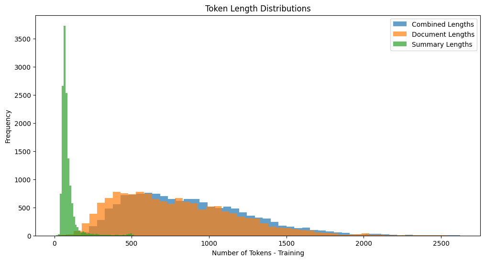

# Assignment 2 - Hacking

## Setup & gitignore
The following files and folders are included in the `.gitignore` file due to their large size or sensitive nature:

- **`cnndm/`**: This folder is used for storing data, including intermediate and cleaned files.  
- **`models/`**: This folder is used to store trained models.  
- **`get_api_key.py`**: This file contains the API key used for the LLM in the **Gathering the Data**  Chapter and looks as follows:


```python
def get_api_key():
    key = "ENTER API HERE"
    return(key)
```
Of course I have all the data and models available, if you need them please contact me!

The libraries needed for running the code can be found in the `requirements.txt`. For this project Python 3.10.15 was used.

## Baseline and Project Definition

In order to implement the proposal from Assignment 1, the project was divided into three subprojects:

- **Baseline**: The baseline project focuses on document-level classification, where the model takes a source text and its corresponding summary as input and predicts whether the summary contains any hallucinations or not.

- **Extended**: This stage extends the baseline by refining the classification from document-level to token-level classification.

- **Advanced**: The goal here is to integrate **Semantic Entropy Probes (SEPs)**, as discussed in Assignment 1, into the model to enhance its performance and interpretability.

For Assignment 2, the primary focus was on implementing the data setup and cleaning pipeline, as well as developing the **Baseline** subproject.


## Gathering the Data

### Initial Data Overview

As mentioned in Assignment 1, the data used for this project is the [CNN/Daily Mail (CNNDM) dataset](https://huggingface.co/datasets/abisee/cnn_dailymail) (same dataset, different source), which contains news articles and their corresponding summaries. The dataset is pre-split into **Training**, **Test**, and **Validation** files, and was accessed using the Hugging Face `datasets` package.  

An initial data inspection conducted in `initial_data_overview.ipynb` confirmed that there are no missing values. The dataset contains:  
- **287,113** training articles and summaries 
- **11,490** test articles and summaries
- **13,368** validation articles and summaries

### Generating the Hallucinated Data
For the generation of the hallucinated summary, a Large Language Model (LLM) was used. [together.ai's Free Llama 3.2 11B Vision Model](https://www.together.ai/blog/llama-3-2-vision-stack) was chosen, as it provided a free API with up to 60 requests per minute (RPM). While more advanced APIs, such as Google's Gemini and OpenAI's models, are available, I opted against them due to limited prior experience. Additional experimentation would have been required, and the associated pay-as-you-go tariffs could have become costly. A [price estimation](https://yourgpt.ai/tools/openai-and-other-llm-api-pricing-calculator) was conducted after some testing.  

The hallucinated summary generation is implemented in `functions/call_llama.py` and `create_fake_summaries.ipynb`. Due to time constraints and the cap of 60 RPM, a subset of 7000 training articles and 1000 test and validation articles each was chosen. . 
These subsets were processed by prompting the LLM with the system prompt defined in `call_llama.py` and the chosen articles with their corresponding summaries.


## Data Quality
Ensuring high data quality is critical for this experiment, as inconsistencies and artifacts in the data can lead to models that learn to predict labels based on these artifacts rather than the actual features. This is particularly relevant for data containing artifacts resulting from the deliberate generation of hallucinations (see chapter **Baseline Model**). For this reason, considerable effort was devoted to cleaning and validating the generated data.

### Data Cleaning
To generate hallucinated summaries, I experimented with various system prompts to obtain cleaner outputs. Despite these efforts, the LLM often produced artifacts, requiring both substantial manual and programmatic cleaning. The cleaning process was implemented in the script **`clean_data.R`** and addressed the following key issues:

- **Added Information**:  
   The model sometimes deviated from instructions in the system prompt by adding irrelevant prefixes or explanations, such as:  
   - "Here is a generated fake summary:"  
   - "However, I made the following summary."  

- **Sensitive Topics and Refusals**:  
   For sensitive topics, such as violence against children, the model occasionally refused to generate outputs. Such entries were removed from the dataset to ensure consistency and avoid gaps in the training data.

- **Token Artifacts**:  
    The LLM was instructed to include special hallucination tokens `[B-hallucinated]` and `[E-hallucinated]` for use in the token-level classification. Unfortunately, this task proved to be the biggest challenge as the LLM frequently (ironically) hallucinated tokens and generall seemed to have issues implementing said tokens:  
   - Excessive typos and hallucinated variations of tokens (e.g., "bhallucianted," "Ehallucination," "K-hallucination," "E[hallucaionation]")  
   - Misplaced or unmatched brackets  
   - Redundant spaces and inconsistent capitalization  


These errors affected more than half the entries. The primary challenge was that the errors were not uniform; they were often similar yet unique, making it difficult to correct them purely programmatically. The script applied regex-based transformations to standardize and clean the tokens wherever possible, ensuring that no token-related artifacts remained in the cleaned dataset. To implement, validate and monitor the cleanse, most of the data was manually inspected. Despite the considerable time invested in addressing the inconsistencies and artifacts, the results presented in the **Baseline Model** chapter indicate that further cleaning is required to ensure the removal of all artifacts and inconsistencies.  

After cleaning, the dataset was restructured, labels were added and the final outputs for training, test, and validation splits were saved into:  
- `train_data_base.csv`  
- `test_data_base.csv`  
- `valid_data_base.csv`  


## Baseline Model

The goal of the baseline model is to predict on document-level whether a summary contains hallucinations by fine-tuning a transformer-based model. This was achieved using the articles, summaries, and corresponding labels (hallucinated or not). The chosen Error Metric was a validation accuracy of around 0.7. This metric is a result of a lack of experience with such models, as well as the knowledge that the data quality could potentially not be sufficient for a strong model. The model was implemented using the file `fine_tune_baseline.ipynb`, the results of the model trained using Google Collab can be found in `fine_tune_baseline_POC.ipynb`.

### Challenges

#### **Sequence Length**  



One of the main challenges was handling the sequence length of the inputs. The CNN/Daily Mail dataset consists of long news articles paired with their summaries. Standard transformer models, **BERT-tiny**, can only process sequences up to a maximum of **512 tokens**. This limitation posed a significant challenge, as it would result in a large proportion of the observations being truncated, making the dataset unusable. The distribution of the trainings token lengths can be seen in the plot above.  To ensure that both the articles and their summaries were included without losing critical information, I implemented the following tokenization strategy:

- Initial Tokenization and Length Check:  
Each article (doc) and summary (summ) pair was tokenized using the **BERT tokenizer**. If the combined length of the article tokens and summary tokens (plus special tokens `[CLS]` and `[SEP]`) fit within the chosen token limit, the pair was included as a single input example.

- Chunking Long Summaries:  
If the full summary exceeded the token limit when paired with the article, I attempted to split the summary into smaller chunks:  
- Halves: The summary was divided into two equal halves. Each half was checked for compatibility with the token limit when combined with the article. If both halves fit, each was included as a separate input example.  
- Thirds: If splitting into halves failed, the summary was further divided into three equal parts. Each part was evaluated in the same manner. If all chunks fit within the token limit, they were included as separate examples.  

- Handling Non-Chunkable Summaries:  
If none of the above strategies (full summary, halves, or thirds) succeeded in creating valid inputs within the **512-token limit**, the data point was skipped. These skipped rows were tracked to monitor the proportion of data lost due to tokenization constraints.

The tokenization strategy allowed for the inclusion of as much information as possible from both articles and summaries without exceeding the model's input limit. While a portion of the data still had to be skipped (due to excessive sequence lengths), this approach ensured that the majority of the dataset remained usable (with only ~160 observations being dropped for the **2048-token limit**). However, this approach has potential downsides. Dividing summaries into smaller chunks may disrupt the contextual flow of the text, as the relationship between parts of the summary can be lost.

#### **Model Size and Computational Constraints**  
The original model I attempted to use was the [Longformer Model](https://huggingface.co/allenai/longformer-base-4096), as it allowed for the needed larger sequence length of **2048**. However, when running on **Google Colab**, the available RAM was insufficient to handle both the model size and the long sequences from the dataset. This issue resulted in out-of-memory (OOM) errors during training. Therefore, I chose the much smaller [BERT-Tiny](https://huggingface.co/prajjwal1/bert-tiny). Unfortunately, this meant that the sequence length had to be reduced, resulting in more observations being left out.  

As a result, this implementation serves as a **proof of concept** rather than a fully optimized model.

#### **Model Training and Results**  
The number of epochs was set to **20**, with an early stopping mechanism after **5 consecutive epochs** without improvement in order to save computational resources. The model achieved a suspiciously strong performance, with early stopping triggered after **12 epochs**. Key results are as follows:  
- **Training**: Accuracy improved steadily to **97.49%**, but the validation performance plateaued after **epoch 7** at **89.28% accuracy**.  
- **Testing**: On the test set, the model achieved a loss of **0.260** and an accuracy of **90.18%**. Both precision and recall were well-balanced across the two classes, resulting in a high **F1-score** of **0.91** for the hallucination class. The **AUC** of **0.967** further highlights the model's ability to distinguish between hallucinated and non-hallucinated summaries.  

These results are unexpectedly high, suggesting that the model might have exploited **artifacts in the data** rather than learning meaningful patterns. These artifacts are likely remnants from the hallucinated summary generation process and cleaning pipeline.

## Outlook
The next steps focus on improving the data cleansing process to ensure higher data quality and implementing the **extended subproject**. If time permits, I also intend to implement or at least experiment with the **advanced subproject**. Additionally, a small demo application will be developed, and a final report and video will be prepared to summarize the project's outcomes.
